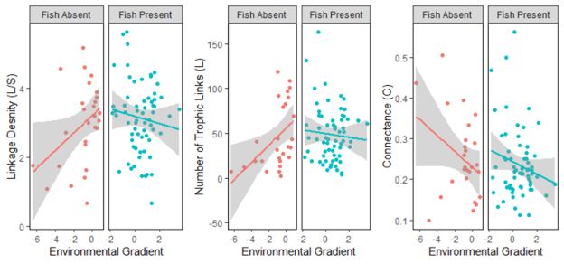

# Food-Web-Structure-Sierra

Title: The Geography of High Elevation Benthic Food Webs

Authors: Matthew D. Green and Kurt E. Anderson

Status of MS: In prep

# Methods 

## Figure 1: Maps of Sampling Sites in the Sierra Nevada, CA

# Results

## Figure 2: Maps of Sampling Sites in the Sierra Nevada, CA

